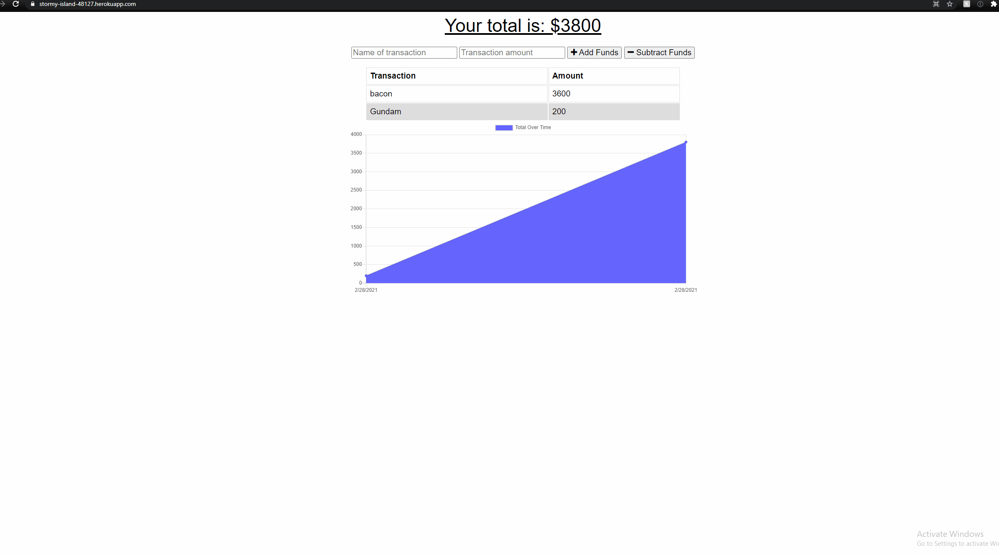

# Title of Website
 

 
### Table of Contents:
* [User Story](##-User-Story)
* [Description](##-Description)
* [Installation](##-Installation)
* [Credits](##-Credits)
* [Contributors](##-Contributors)
* [License](##-License)
 
## Deployed site
[progressiveBudget](https://stormy-island-48127.herokuapp.com/)

 
## User Story
A budget app to keep track of funds.
 
## Description
A budget app using NODEJS EXPRESS and MONGOOSE
 
## Installation
To run this locally you will need to install all dependencies by doing npm i  
 
## Contributors
Efrain Nevarez
 
## Credits
NODEJS EXPRESS MONGOOSE MONGODB HTML CSS
 
## License
This project is licensed by MIT